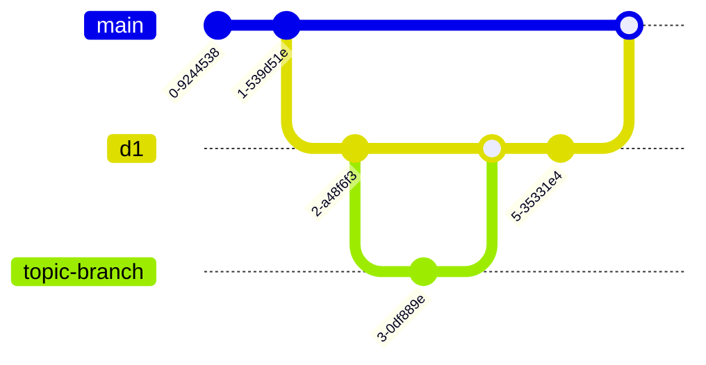

# Ardeeno-WebApp
A Web Application developed for the company Ardeeno to sell their sensors, manage  and provide to its clients data analysis. Ardeeno is a company that provides air-monitoring IoT solutions.

## WorkFlow
- `pm` Branch: Used to add PM Stuff (Gantt, Team Meeting Agendas, ...)
- `main` Branch
- `di` Branch: Used to work on Deliverable-i
  - `topic-branch`: Used to work on a certain topic of Deliverable-i  

From `di` branch create a new `topic-branch`. Do all the work you have to do, then do `git push origin topic-branch` and open a pull request to Di Branch on GitHub.  
After the merge conflicts have been solved, do `git fetch`, `git checkout di`, `git pull`.

When the Deliverable-i is complete we will merge `di` to `main` and load the pdf in `T41-SE22/ardeeno-deliverables`

### Visualized



## Commit Messages
```bash
git commit -m "My Commit message
[\n
hh:mm]
[\n
\n
Co-authored-by: name <name@example.com>
Co-authored-by: another-name <another-name@example.com>]"
```
This will help us keep track of work-time. `hh:mm` represents the work-time spent between this commit and the last commit with the field `hh:mm`. Please always use `hh:mm` when co-authoring.

For co-authoring use these (the name is irrelevant, the mail is needed to link the commit with your github account):
- Alessandro Manfucci \<alessandro.manfucci@gmail.com\>
- Matteo Sottocornola \<m.sottocornola-1@studenti.unitn.it\>
- Enrico Cescato \<enrico.cescato@studenti.unitn.it\>