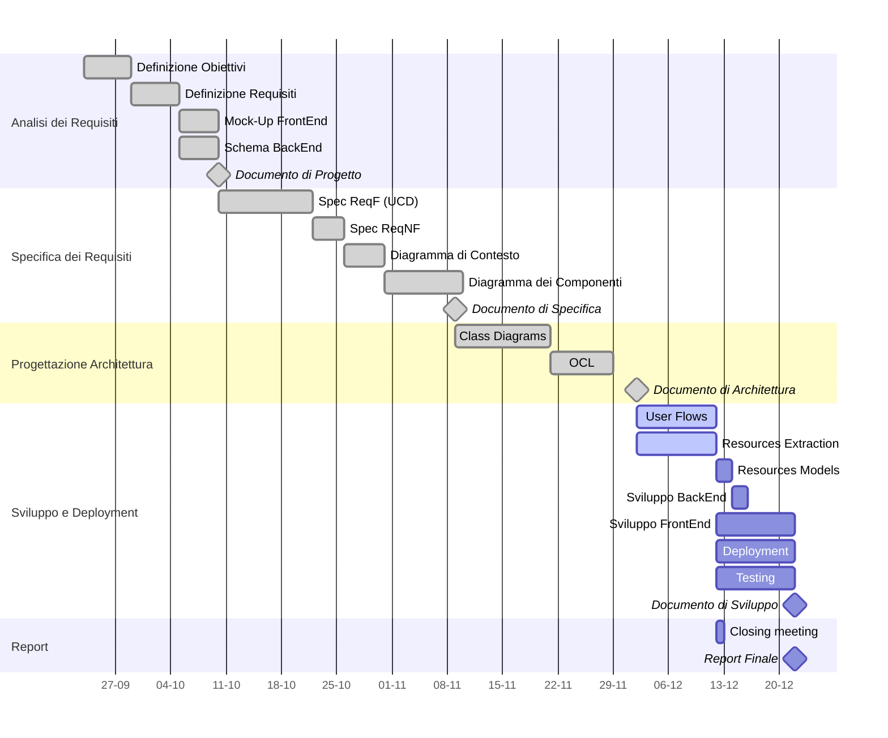

# Project Plan

### Gantt Diagram

### Tasks List

|**Deliverable**|**Task**|**Assignees**|**Due**|**Status**|
|---------|---------|-----|---|---|
|Documento di Progetto       |Definizione Obiettivi   |A,E,M|27/09|Done|
|                            |Definizione Requisiti   |A,E|10/10|Done|
|                            |Mock-Up FrontEnd        |A,M|10/10|Done|
|                            |Schema BackEnd          |A|10/10|Done|
|Documento di Specifica      |Spec ReqF               |A,E,M|24/10|Done|
|                            |Spec ReqNF              |A|24/10|Done|
|                            |Diagramma di Contesto   |A|30/10|Done|
|                            |Diagramma dei Componenti|A,M|9/11|Done|
|Documento di Architettura   |Class Diagrams          |A,E|23/11|Done|
|                            |OCL                     |A|02/12|Done|
|Documento di Sviluppo       |User Flows              |A,M|12/12|Active|
|                            |Resources Extraction    |A|12/12|Active|
|                            |Resources Models        |A|14/12|Active|
|                            |Sviluppo BackEnd        |A,E,M|16/12|Active|
|                            |Sviluppo FrontEnd       |A|22/12|Active|
|                            |Deployment              |A|22/12|Active|
|                            |Testing                 |A,E,M|22/12|Active|