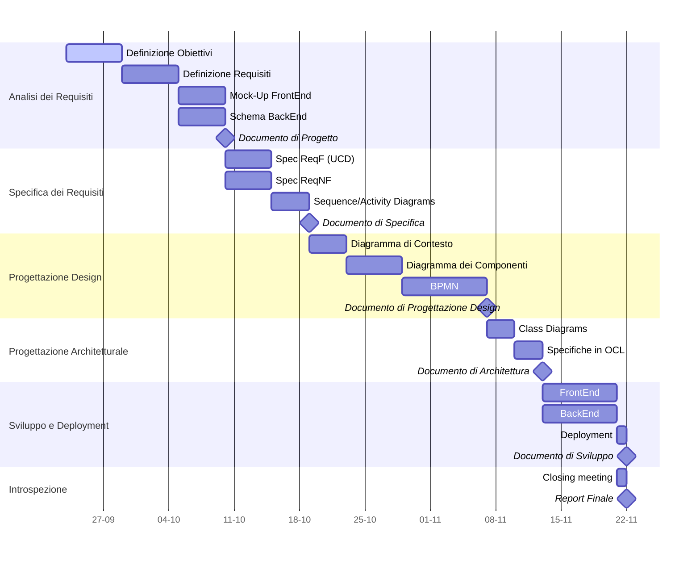

# Project Plan

## Gantt Diagram

## Tasks List

| **Task**               | **Assigned To(A,E,M)** | **Due To** | **Status** |
|------------------------|------------------------|------------|------------|
|Definizione Obiettivi   |A,E,M|27/09|Active|
|Definizione Requisiti   |A,E|10/10||
|Mock-Up FrontEnd        |E|10/10||
|Schema BackEnd          |M|10/10||
|Spec ReqF               |||||
|Spec ReqNF              |||||
|Sequence Diagrams       |||||
|Diagramma di Contesto   |||||
|Diagramma dei Componenti|||||
|BPMN                    |||||
|Class Diagrams          |||||
|Specifiche in OCL       |||||
|FrontEnd                |||||
|BackEnd                 |||||
|Deployment              |||||