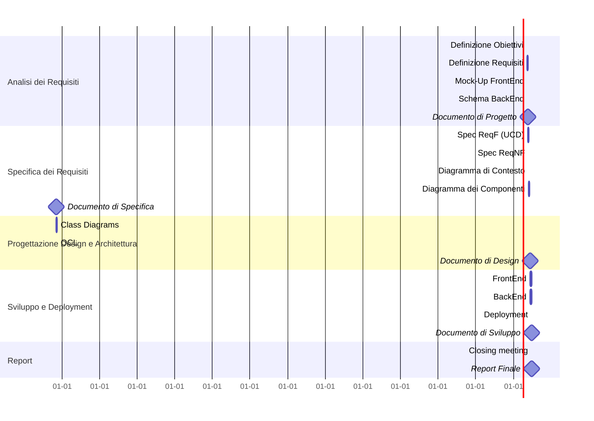

# Project Plan

## Gantt Diagram

## Tasks List

| **Task**               | **Assigned To(A,E,M)** | **Due To** | **Status** |
|------------------------|------------------------|------------|------------|
|Definizione Obiettivi   |A,E,M|27/09|Done|
|Definizione Requisiti   |A,E|10/10|Done|
|Mock-Up FrontEnd        |A,M|10/10|Done|
|Schema BackEnd          |A|10/10|Done|
|Spec ReqF               |A,E,M|24/10|Active|
|Spec ReqNF              |A|24/10|Done|
|Diagramma di Contesto   |A|30/10|Done|
|Diagramma dei Componenti|A,M|9/11|Active|
|Class Diagrams          |A,E,M|23/11||
|OCL                     |TBA|||
|BPMN                    ||||
|FrontEnd                ||||
|BackEnd                 ||||
|Deployment              ||||